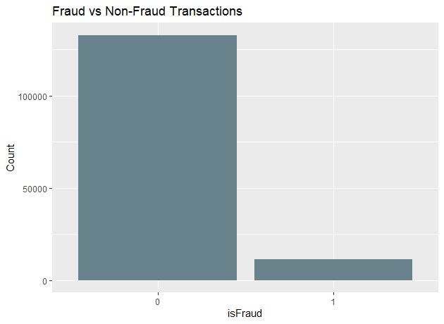
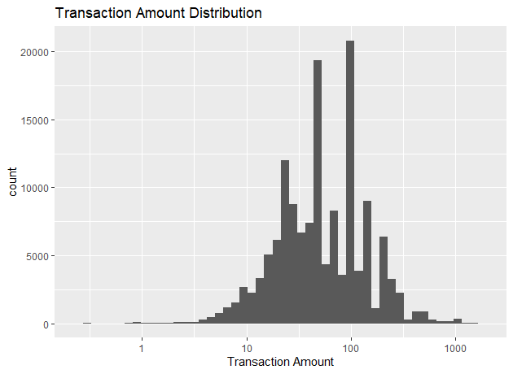

[Website](https://rf-capstone-project.github.io/project/)

[Slides](https://rf-capstone-project.github.io/project/slides.html)

## Introduction

Modern data problems often involve large and noisy datasets where simple predictive models fail to capture complex patterns. Random Forests address these challenges by combining the strengths of many decision trees into one powerful ensemble, providing a scalable approach across a wide range of domains, and is commonly used for classification and regression tasks. First developed in the late 1990s and popularized in the early 2000s, Random Forests (RF) improve predictive performance by aggregating the outputs of multiple decision trees built from randomly sampled subsets of data. In general, the popularity of tree-based methods in machine learning has increased exponentially, due to their capacity to produce reliable and readable results, while being flexible on the type of data they can handle [@Louppe2015]. Random Forest’s acceptance is also supported by the fact that it allows clearly defined criteria to be analyzed and does not behave as a black box. This is ideal for domains that often deal with regulatory scrutiny or have a need to develop deeper insights into their classification process. The success of RFs is also explained based on the following factors [@Louppe2015]:

- Non-parametric character, leading to flexible models.
- Capacity for handling different types of data.
- Decision trees perform feature selection, making them resilient to irrelevant or noisy variables.
- Robustness to outliers or errors in the label variable.
- Ease of interpretability.

Random Forests are adept at modeling complex, non-linear relationships within data, making them effective for tasks where interactions between features are not easily captured by linear models [@Breiman2001]. This capability stems from their ensemble approach, where multiple decision trees are trained on random subsets of the data. Additionally, RFs provide a mechanism for assessing feature importance through permutation methods, by evaluating the increase in prediction error when the values of a particular feature are randomly shuffled. This allows RFs to identify which variables have a greater impact on the model's predictions [@Genuer2010]. However, it is essential to note that these importance measures can be biased, especially when features are correlated or when there are many irrelevant variables [@Li2019].  Another feature of RFs is the use of out-of-bag (OOB) samples (data points not included in the training of a particular tree) to estimate the model's generalization error. This OOB error estimate provides an internal validation mechanism, reducing the need for a separate validation dataset,  and offering a more efficient means of assessing model performance [@Breiman2001];[@Angrist1996].


In recent years, research has continued to demonstrate how Random Forests can be adapted and improved to meet specific data challenges. For example, Nami and Shajari [@Nami2018] introduced a dynamic Random Forest combined with k-nearest neighbors to detect payment card fraud, prioritizing the prevention of financial loss rather than just model accuracy. This approach reduced fraud related losses by about 23% by focusing on recent transaction behavior and adapting to behavioral drift over time. Similarly, Flondor, Donath, and Neamțu [@Flondor2024] examined decision tree based approaches to credit card fraud detection using large datasets, identifying features such as transaction amount and merchant name as the most influential variables. Their findings emphasized that decision trees, while simple, remain highly interpretable and practical for real-time fraud detection.
Other researchers have built upon these foundations to enhance Random Forest performance in imbalanced data settings. Lin and Jiang [@LinJiang2021] proposed an Autoencoder–Probabilistic Random Forest (AE-PRF) framework that first compresses input features through an autoencoder before applying a probabilistic ensemble. This hybrid achieved a true positive rate near 0.89 on a highly imbalanced credit card dataset, outperforming traditional models. Similarly, Sundaravadivel et al. [@Sundaravadivel2025] demonstrated that combining Synthetic Minority Over Sampling Techniques (SMOTE) with Random Forests can significantly improve fraud detection precision and recall while maintaining low false-positive rates.


Beyond fraud detection, foundational work such as that by Myles et al. [@Myles2004] continues to highlight the interpretability and flexibility of decision tree algorithms (including CART and C4.5), explaining how Random Forests inherit these advantages while overcoming overfitting issues common in single-tree models. Complementary overviews, such as the one presented by Salman, Kalakech, and Steiti [@Salman2024], further clarify that Random Forests extend the CART framework by building many trees on bootstrap samples and random feature subsets, improving resilience to noisy or incomplete data.
Subsequent research has continued to refine RF techniques through alternative voting schemes, improved sampling strategies, algorithm combinations, and weighting adjustments aimed at enhancing accuracy and adaptability to specific domains [@Khaleb2014].

Voting methods for RFs have continued to evolve over the years to more than just a simple weighted average and have played a significant role in accuracy improvements for models. For example, in Robnik-Sikonja, it was found that when several feature evaluation measures (e.g., Accuracy, AUC, Gini index, Gain ratio, MDL, ReliefF, Myopic ReliefF) were used instead of just one, the correlation between trees decreased and the overall model performance improved [@Robnik2004]. Another example of a voting method proposed by [@Tsymbal2008] is the dynamic selection method which was developed to handle concept drifts that generally occur over a model’s lifecycle. This method weights the tree with the best local predictive performance and then proportionally weights each tree within the forest based on this. When this was applied to an antibiotic resistance study, model performance improved by more than 10% on average.

For instance, K-Means Clustering has been combined with RF in [@Al-Abadi2023] to improve security in Internet of Medical Things (IoMT) networks, which transmit sensitive patient data via connected sensors. The proposed methodology enhances the Random Forest algorithm (ERF) using Principal Component Analysis (PCA) for dimensionality reduction, reducing redundant features and execution time, while maintaining 99% accuracy and sensitivity. With optimized parameters (20 trees, 10 features per split, 80% sampling, and depth 25), the Enhanced Random Forest (ERF) outperformed AdaBoost and CatBoost. Additionally, Malley et al. (2012), as cited in [@Valavi2021], proposed using Random Forest regression instead of classification to model species distribution data, where classes are represented as 0 and 1 and interpreted as probabilities within the range {0, 1}.


In this paper, we apply Random Forests to classify card transactions as legitimate or fraudulent. To address the severe class imbalance, we experiment with resampling strategies and enhancements such as bagging, boosting, or cost-sensitive learning. We also evaluate the model using metrics beyond simple accuracy, such as precision, recall, F1-score, and area under the ROC curve to capture performance in a setting where false negatives carry significant monetary risk to the bottom line [@Zhang2024]. The main goals of this paper are to explain the concept and underlying methodology of Random Forest decision trees and explore how its features enable effective applications such as credit card fraud detection.


## Method

Random Forests is an ensemble method that combines many decision trees to improve accuracy and robustness in both classification and regression. The central idea is to grow many trees, each built on different randomization (bootstrap sampling + random feature selection), and then aggregate their predictions. The process continues until all of the dependent target variables have reached a leaf node. Once this process has been repeated a defined number of times, the trees that have been created are aggregated during the decision process and a prediction is made.

***Process***

- Training:  
  - Each tree is built on a bootstrap sample of the data. At each node, instead of using all predictors, a random subset is chosen, and the best split among them is selected (Figure 1).
- Prediction:  
  - Classification: final output is the majority vote of the trees.  
  - Regression: final output is the average of the tree predictions.


:::{.text-center}
{#fig-figure1}

:::

Formally, [@Breiman2001] defines a Random Forest as a collection of classifiers:


$$\{h(x, \Theta_k), \; k = 1, \ldots, K\}$$
Where each $\Theta_k$ represents a vector of random variables involving both bootstrap sampling and random feature selection. The RF prediction can be written as follows:

$$
\hat{f}(x) = \text{majority vote}\{h(x,\Theta_k)\}, \; k = 1, \ldots, K
$$


In the tree building process an impurity measure $i(t)$ evaluates the quality of a node $t$, with smaller values indicating purer nodes and therefore better predictions $\hat{f}_t(x)$


***Splitting Criteria***

Classification
Impurity function based on the Shannon Entropy  (Shannon and Weaver, 1949, as cited in [@Louppe2015]):

$$  i_H(t)=-\sum_{k=1}^{J}p(c_k|t)log_2(p(c_k|t))  $$
Impurity function based on the Gini index (Gini, 1912, as cited in [@Louppe2015]:

$$  i+G(t)=-\sum_{k=1}^{J}p(c_k|t)(1-p(c_k|t))  $$

***Approaches to class imbalance***


- Applying Weights: Higher weights are assigned to the minority class and incorporated into the Gini index, affecting both the choice of splits and the weighting of terminal nodes in each tree [@Valavi2021].
- Equal Sampling: Involves creating multiple datasets (from the original data). Separate Random Forest models are trained on each dataset, and the final prediction is obtained by averaging the predictions of all models [@Valavi2021].

- Down Sampling: Each tree uses all minority-class samples and a randomly selected subset of majority-class samples equal in size to the minority. Because different trees may use different subsets, the method effectively incorporates many majority samples across the forest [@Valavi2021].

- Synthetic Minority Over-Sampling Technique (SMOTE) (Figure 2). The process begins by selecting a sample from the minority class. After that, it measures the feature wise difference between this sample and one of its nearest neighbors. Finally, this difference is scaled by a random value ranging from 0 to 1[@Zhang2024].


:::{.text-center}
{#fig-figure2}
:::

Expanding on the SMOTE methodology, there have also been successful applications of integrating Global Adversarial Networks (GAN) to improve data sample quality. This integrated method continuously tests the synthetic data generated during the SMOTE process to determine if it can fool the GAN model a certain percentage of the time. In experimentation, once the sampling was able to fool the GAN model over 50% of the time, the RF trained with this data returned the highest performance compared to traditional methods of oversampling, such as just using SMOTE [@Ghaleb2023].

One last oversampling technique that has been shown to improve the model performance is the Iterative Nearest Neighborhood Oversampling (INNO) method. This method iteratively uses a small set of data samples and finds the distance between the samples to determine the density of the feature space and establishes a similarity score that is then used to apply to all the samples. This means that when there is more sample data in a certain feature space, there is a higher chance that the sample with the highest similarity score will be built upon and then this process repeats until the dataset meets a specific balance target. Although this was amongst multi-class targets, the results from this method showed that classification performance improved as the class imbalance ratio rose from 0.1 to 0.4 using INNO sampling [@Yu2015].


Beyond sampling strategies, Random Forests use internal validation methods such as Out-of-Bag (OOB) error estimation. During training, each bootstrap sample leaves out about a third of the observations, which can then be used to evaluate model performance without needing a separate validation set. This approach provides an unbiased measure of error and helps to refine parameters such as tree depth and the number of features considered at each split.


In addition to dataset balancing techniques, pruning techniques are also needed to eliminate noise and to improve performance by handling possible bias and variance from the sampling process. In [Zhou2021], it’s found that in low signal to noise domains, by reducing the depth of trees, the shallowness of trees is able to create noticeable gains in accuracy whereas with medium and high signal to noise ratios, there were no noticeable gains in model accuracy. This pruning technique not only demonstrated improved performance but also reduced the cost for training the model which has applications in resource constrained environments.


## Analysis and Results


***Data Description***

The used dataset, publicly available on Kaggle, was provided by Vesta Corporation, a payment processing company. It comprises real-world e-commerce transactions and includes a variety of features ranging from device type to product attributes. Additionally, as this dataset was generated from actual transaction data, many of its features have been masked to protect user privacy. In order to overcome this masking, we have used descriptive, summary information to identify the likely information these fields contain and map them to the appropriate type of information. Table 1 illustrates the features.


| Type of Variable | Variable Name | Description |
|------------------|----------------|--------------|
| Binary | isFraud | The target label (0 or 1) indicating whether the transaction was fraudulent or not |
| Date | TransactionDT | The time difference (in seconds) from a reference point (i.e. a “baseline” timestamp) — not an absolute timestamp |
| Continuous | TransactionAmt | The amount (in USD) of the transaction |
| Categorical | ProductCD | A categorical code indicating the type of product associated with the transaction |
| Categorical | card1–card6 | A masked attribute about the payment card (e.g. issuer, category, country) used in the transaction |
| Descriptive | P_emaildomain | The purchaser’s (sender’s) email domain (e.g. “gmail.com”, etc.) |
| Descriptive | R_emaildomain | The receiver’s (payee’s) email domain |
| Continuous | C1–C14 | An anonymized count (frequency metrics) capturing how many times some relevant event/entity combination has occurred historically or in relation to that transaction |
| Continuous | Id_01, id_02, id_05, id_06, id_11 | Masked variables that likely represent continuous identity metrics (e.g. score, risk metric, count, rating) |
| Descriptive | id_12, id_15, id_16, id_28, id_29, id_30, id_31, id_33, id_34, id_35, id_36, id_37, id_38 | Masked variables that likely represent encoded device info, IP domains, browser types, OS versions, network identifiers, or anonymized hashing of identity attributes |
| Descriptive | DeviceType | A categorical descriptor of the type of device used in the transaction (e.g. “desktop”, “mobile”) |
| Descriptive | DeviceInfo | Further device information (e.g. device model, browser, OS) as a masked categorical string |
| Continuous | PC1–PC10 | PCA variables that were transformed from highly dimensional values from V1–V339 |

        Table 1: IEEE-CIS Fraud Detection Data.
        
***Data Cleaning***

The original dataset was provided in two tables ( Transactions and Identity), related by the variable TransactionID. A quick exploration revealed that not every record in Transaction, had a corresponding entry in the Identity set. The tables were merged dropping the rows with no match. This reduced the data to 144233 records.

```{r}
#| eval: false
#| echo: true
# merging training sets
train_merged <- merge(train_trans, train_id, by = "TransactionID")

```

PCA was applied to a subset of the original features (Vesta engineered  variables V1-V339), resulting in 10 principal components to explain the majority of the variance from these features.

```{r}
#| eval: false
#| echo: true
# Run PCA
pca_result <- prcomp(train_merged[, v_cols], center = TRUE, scale. = TRUE)
summary(pca_result)
# keeping the first 10 PCs explaining 72.10% of the variance
train_pca_df <- as.data.frame(pca_result$x)
train_pca <- select(train_pca_df, 1:10)

```

Features with large percentage of missing values were verified and dropped.

```{r}
#| eval: false
#| echo: true
miss_var_summary(train_merged) %>% print(n = Inf) # summarize missing values
train_merged <- drop_f("dist1")
# dropping dist2
train_merged <- drop_f("dist2")
# dropping addr1
train_merged <- drop_f("addr1")

```

Example of handling the sequential generic features (e.g. D1...D15, id_1...id_38)


```{r}
#| eval: false
#| echo: true
d_cols <- paste0("D", 1:15) # creates a vector with the names
dcols_drop <- d_cols[-1]
train_merged <- train_merged[, !names(train_merged) %in% dcols_drop, drop = FALSE]

```

Example of verifying and removing constant columns.

```{r}
#| eval: false
#| echo: true
v_cols <- paste0("V", 1:339) # creates a vector with the names
# checking for constant colmuns
for (col in v_cols) {
  if (sd(train_merged[[col]]) == 0)
    print(col)
  }

# remove constant columns
v_cols <- v_cols[v_cols != c("V107", "V305")]

```

The missing numeroc values were filled with the column mean. While the categorical missing values were filled with a level called "unknown".

```{r}
#| eval: false
#| echo: true

# fill numeric missing values
train_final[] <- lapply(train_final, function(col) {
  if (is.numeric(col)) {
    col[is.na(col)] <- mean(col, na.rm = TRUE)
  }
  col
})

# fill categorical missing values
train_final[] <- lapply(train_final, function(col) {
  if (is.character(col)) {
    col[is.na(col)] <- "unknown"
  }
  col
})

```  
<p>&nbsp;</p>


Following data preprocessing, the distribution of the target variable between its two levels is shown below, with 92.15% non fraud vs 7.95% fraud cases.  

<p>&nbsp;</p>

:::{.text-center}
{#fig-figure3}
:::  

<p>&nbsp;</p>

Transacction amount distribution.

:::{.text-center}
{#fig}
:::  

<p>&nbsp;</p>

Transacction amount distribution per fraud level.

:::{.text-center}
{#fig}
:::  

<p>&nbsp;</p>

Continuing with the visualizations, this section explores additional aspects of the dataset through a series of graphical representations. These images highlight the relationship of the categorical features with the target variable.


:::{.text-center}
{#fig-figure4}

:::  

<p>&nbsp;</p>

:::{.text-center}
{#fig-figure5}

:::  

<p>&nbsp;</p>


:::{.text-center}
{#fig-figure6}

:::  

<p>&nbsp;</p>

:::{.text-center}
{#fig-figure7}

:::


## Conclusions

## References


