[Slides](slides.html)
<!---(https://rf-capstone-project.github.io/project/slides.html)--->

## Introduction

Modern data problems often involve large and noisy datasets where simple predictive models fail to capture complex patterns. Random Forests address these challenges by combining the strengths of many decision trees into one powerful ensemble, providing a scalable approach across a wide range of domains, and is commonly used for classification and regression tasks. First developed in the late 1990s and popularized in the early 2000s, Random Forests (RF) improve predictive performance by aggregating the outputs of multiple decision trees built from randomly sampled subsets of data. In general, the popularity of tree-based methods in machine learning has increased exponentially, due to their capacity to produce reliable and readable results, while being flexible on the type of data they can handle [@Louppe2015]. Random Forest’s acceptance is also supported by the fact that it allows clearly defined criteria to be analyzed and does not behave as a black box. This is ideal for domains that often deal with regulatory scrutiny or have a need to develop deeper insights into their classification process. The success of RFs is also explained based on the following factors [@Louppe2015]:

- Non-parametric character, leading to flexible models.
- Capacity for handling different types of data.
- Decision trees perform feature selection, making them resilient to irrelevant or noisy variables.
- Robustness to outliers or errors in the label variable.

Random Forests are adept at modeling complex, non-linear relationships within data, making them effective for tasks where interactions between features are not easily captured by linear models [@Breiman2001]. This capability stems from their ensemble approach, where multiple decision trees are trained on random subsets of the data. Additionally, RFs provide a mechanism for assessing feature importance through permutation methods, by evaluating the increase in prediction error when the values of a particular feature are randomly shuffled. This allows RFs to identify which variables have a greater impact on the model's predictions [@Genuer2010]. However, it is essential to note that these importance measures can be biased, especially when features are correlated or when there are many irrelevant variables [@Li2019].  Another feature of RFs is the use of out-of-bag (OOB) samples (data points not included in the training of a particular tree) to estimate the model's generalization error. This OOB error estimate provides an internal validation mechanism, reducing the need for a separate validation dataset,  and offering a more efficient means of assessing model performance [@Breiman2001];[@Angrist1996].


In recent years, research has continued to demonstrate how Random Forests can be adapted and improved to meet specific data challenges. For example, Nami and Shajari [@Nami2018] introduced a dynamic Random Forest combined with k-nearest neighbors to detect payment card fraud, prioritizing the prevention of financial loss rather than just model accuracy. This approach reduced fraud related losses by about 23% by focusing on recent transaction behavior and adapting to behavioral drift over time. Similarly, Flondor, Donath, and Neamțu [@Flondor2024] examined decision tree based approaches to credit card fraud detection using large datasets, identifying features such as transaction amount and merchant name as the most influential variables. Their findings emphasized that decision trees, while simple, remain highly interpretable and practical for real-time fraud detection.
Other researchers have built upon these foundations to enhance Random Forest performance in imbalanced data settings. Lin and Jiang [@LinJiang2021] proposed an Autoencoder–Probabilistic Random Forest (AE-PRF) framework that first compresses input features through an autoencoder before applying a probabilistic ensemble. This hybrid achieved a true positive rate near 0.89 on a highly imbalanced credit card dataset, outperforming traditional models. Similarly, Sundaravadivel et al. [@Sundaravadivel2025] demonstrated that combining Synthetic Minority Over Sampling Techniques (SMOTE) with Random Forests can significantly improve fraud detection precision and recall while maintaining low false-positive rates.


Beyond fraud detection, foundational work such as that by Myles et al. [@Myles2004] continues to highlight the interpretability and flexibility of decision tree algorithms (including CART and C4.5), explaining how Random Forests inherit these advantages while overcoming overfitting issues common in single-tree models. Complementary overviews, such as the one presented by Salman, Kalakech, and Steiti [@Salman2024], further clarify that Random Forests extend the CART framework by building many trees on bootstrap samples and random feature subsets, improving resilience to noisy or incomplete data.
Subsequent research has continued to refine RF techniques through alternative voting schemes, improved sampling strategies, algorithm combinations, and weighting adjustments aimed at enhancing accuracy and adaptability to specific domains [@Khaleb2014].

Voting methods for RFs have continued to evolve over the years to more than just a simple weighted average and have played a significant role in accuracy improvements for models. For example, in Robnik-Sikonja, it was found that when several feature evaluation measures (e.g., Accuracy, AUC, Gini index, Gain ratio, MDL, ReliefF, Myopic ReliefF) were used instead of just one, the correlation between trees decreased and the overall model performance improved [@Robnik2004]. Another example of a voting method proposed by [@Tsymbal2008] is the dynamic selection method which was developed to handle concept drifts that generally occur over a model’s lifecycle. This method weights the tree with the best local predictive performance and then proportionally weights each tree within the forest based on this. When this was applied to an antibiotic resistance study, model performance improved by more than 10% on average.

For instance, K-Means Clustering has been combined with RF in [@Al-Abadi2023] to improve security in Internet of Medical Things (IoMT) networks, which transmit sensitive patient data via connected sensors. The proposed methodology enhances the Random Forest algorithm (ERF) using Principal Component Analysis (PCA) for dimensionality reduction, reducing redundant features and execution time, while maintaining 99% accuracy and sensitivity. With optimized parameters (20 trees, 10 features per split, 80% sampling, and depth 25), the Enhanced Random Forest (ERF) outperformed AdaBoost and CatBoost. Additionally, Malley et al. (2012), as cited in [@Valavi2021], proposed using Random Forest regression instead of classification to model species distribution data, where classes are represented as 0 and 1 and interpreted as probabilities within the range {0, 1}.


In this paper, we apply Random Forests to classify card transactions as legitimate or fraudulent. To address the severe class imbalance, we experiment with resampling strategies and enhancements such as bagging, boosting, or cost-sensitive learning. We also evaluate the model using metrics beyond simple accuracy, such as precision, recall, F1-score, and area under the ROC curve to capture performance in a setting where false negatives carry significant monetary risk to the bottom line [@Zhang2024]. The main goals of this paper are to explain the concept and underlying methodology of Random Forest decision trees and explore how its features enable effective applications such as credit card fraud detection.


## Method

Random Forests is an ensemble method that combines many decision trees to improve accuracy and robustness in both classification and regression. The central idea is to grow many trees, each built on different randomization (bootstrap sampling + random feature selection), and then aggregate their predictions. The process continues until all of the dependent target variables have reached a leaf node. Once this process has been repeated a defined number of times, the trees that have been created are aggregated during the decision process and a prediction is made.

***Process***

- Training:  
  - Each tree is built on a bootstrap sample of the data. At each node, instead of using all predictors, a random subset is chosen, and the best split among them is selected (@fig-figure1)
- Prediction:  
  - Classification: final output is the majority vote of the trees.  
  - Regression: final output is the average of the tree predictions.


:::{.text-center}
{#fig-figure1}

:::

Formally, [@Breiman2001] defines a Random Forest as a collection of classifiers:


$$\{h(x, \Theta_k), \; k = 1, \ldots, K\}$$
Where each $\Theta_k$ represents a vector of random variables involving both bootstrap sampling and random feature selection. The RF prediction can be written as follows:

$$
\hat{f}(x) = \text{majority vote}\{h(x,\Theta_k)\}, \; k = 1, \ldots, K
$$


In the tree building process an impurity measure $i(t)$ evaluates the quality of a node $t$, with smaller values indicating purer nodes and therefore better predictions $\hat{f}_t(x)$

***Hyperparameter Tuning***  

Hyperparameter tuning helps Random Forests create a balance between model complexity, computational efficiency, and generalization performance. One of the most influential parameters is the number of trees in the ensemble (*ntree*). Increasing this value usually reduces variance and improves overall stability, although the gains eventually level out while computational cost continues to rise. The maximum depth of each tree (*maxnodes*) also plays an important role. Deeper trees can capture complex patterns in the data, but they may overfit when allowed to grow without constraint.  

Another key parameter is the number of features considered at each split (*mtry*). Limiting this value prevents a small group of strong predictors from dominating every decision and helps reduce correlation across the forest. Also, parameters such as *nodesize* prevent the model from creating branches based on very small sample sizes, making the model less sensitive to noise.  

The bootstrap setting determines whether sampling occurs with replacement when generating training subsets for each tree. While this behavior is standard, not using bootstrapping can be useful in smaller datasets where more unique samples may be wanted. In practice, methods such as grid search and randomized search are commonly used to evaluate combinations of these hyperparameters, improving model accuracy and robustness in a systematic way [@Probst2019].


***Splitting Criteria***

Classification
Impurity function based on the Shannon Entropy  (Shannon and Weaver, 1949, as cited in [@Louppe2015]):

$$  i_H(t)=-\sum_{k=1}^{J}p(c_k|t)log_2(p(c_k|t))  $$

Impurity function based on the Gini index (Gini, 1912, as cited in [@Louppe2015]:

$$  i_G(t)=\sum_{k=1}^{J}p(c_k|t)(1-p(c_k|t))  $$

***Approaches to class imbalance***


- Applying Weights: Higher weights are assigned to the minority class and incorporated into the Gini index, affecting both the choice of splits and the weighting of terminal nodes in each tree [@Valavi2021].
- Equal Sampling: Involves creating multiple datasets (from the original data). Separate Random Forest models are trained on each dataset, and the final prediction is obtained by averaging the predictions of all models [@Valavi2021].

- Down Sampling: Each tree uses all minority-class samples and a randomly selected subset of majority-class samples equal in size to the minority. Because different trees may use different subsets, the method effectively incorporates many majority samples across the forest [@Valavi2021].

- Synthetic Minority Over-Sampling Technique (SMOTE) (@fig-figure2). The process begins by selecting a sample from the minority class. After that, it measures the feature wise difference between this sample and one of its nearest neighbors. Finally, this difference is scaled by a random value ranging from 0 to 1[@Zhang2024].


:::{.text-center}
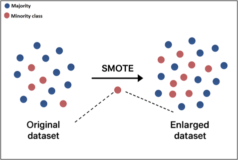{#fig-figure2}
:::

Expanding on the SMOTE methodology, there have also been successful applications of integrating Global Adversarial Networks (GAN) to improve data sample quality. In experimentation, once a sampling was able to fool a GAN model over 50% of the time, the RF trained with this data returned the highest performance compared to traditional methods of oversampling [@Ghaleb2023]. Another oversampling technique that has been shown to improve the model performance is the Iterative Nearest Neighborhood Oversampling (INNO) method. This method iteratively uses a small set of data samples and finds the distance between the samples to determine the density of the feature space and establishes a similarity score that is then used to apply to all the samples. In experimentation, this method showed that classification performance improved as the class imbalance ratio rose from 0.1 to 0.4 using INNO sampling [@Yu2015].


Beyond sampling strategies, Random Forests use internal validation methods such as Out-of-Bag (OOB) error estimation. During training, each bootstrap sample leaves out about a third of the observations, which can then be used to evaluate model performance without needing a separate validation set. This approach provides an unbiased measure of error and helps to refine parameters such as tree depth and the number of features considered at each split.


In addition to dataset balancing techniques, pruning techniques are also needed to eliminate noise and to improve performance by handling possible bias and variance from the sampling process. In [@Zhou2021], it’s found that in low signal to noise domains, by reducing the depth of trees, the shallowness of trees is able to create noticeable gains in accuracy whereas with medium and high signal to noise ratios, there were no noticeable gains in model accuracy. This pruning technique not only demonstrated improved performance but also reduced the cost for training the model which has applications in resource constrained environments.


## Analysis and Results


***Data Description***

The used dataset, publicly available on Kaggle, was provided by Vesta Corporation, a payment processing company. It comprises real-world e-commerce transactions and includes a variety of features ranging from device type to product attributes. Additionally, as this dataset was generated from actual transaction data, many of its features have been masked to protect user privacy. In order to overcome this masking, we have used descriptive, summary information to identify the likely information these fields contain and map them to the appropriate type of information. Table 1 illustrates the features.


| Type of Variable | Variable Name | Description |
|------------------|----------------|--------------|
| Binary | isFraud | The target label (0 or 1) indicating whether the transaction was fraudulent or not |
| Date | TransactionDT | The time difference (in seconds) from a reference point (i.e. a “baseline” timestamp) — not an absolute timestamp |
| Continuous | TransactionAmt | The amount (in USD) of the transaction |
| Categorical | ProductCD | A categorical code indicating the type of product associated with the transaction |
| Categorical | card1–card6 | A masked attribute about the payment card (e.g. issuer, category, country) used in the transaction |
| Descriptive | P_emaildomain | The purchaser’s (sender’s) email domain (e.g. “gmail.com”, etc.) |
| Descriptive | R_emaildomain | The receiver’s (payee’s) email domain |
| Continuous | C1–C14 | An anonymized count (frequency metrics) capturing how many times some relevant event/entity combination has occurred historically or in relation to that transaction |
| Continuous | Id_01, id_02, id_05, id_06, id_11 | Masked variables that likely represent continuous identity metrics (e.g. score, risk metric, count, rating) |
| Descriptive | id_12, id_15, id_16, id_28, id_29, id_30, id_31, id_33, id_34, id_35, id_36, id_37, id_38 | Masked variables that likely represent encoded device info, IP domains, browser types, OS versions, network identifiers, or anonymized hashing of identity attributes |
| Descriptive | DeviceType | A categorical descriptor of the type of device used in the transaction (e.g. “desktop”, “mobile”) |
| Descriptive | DeviceInfo | Further device information (e.g. device model, browser, OS) as a masked categorical string |
| Continuous | PC1–PC10 | PCA variables that were transformed from highly dimensional values from V1–V339 |

        Table 1: IEEE-CIS Fraud Detection Data.
        
***Data Cleaning***

The original dataset was provided in two tables ( Transactions and Identity), related by the variable TransactionID. A quick exploration revealed that not every record in Transaction, had a corresponding entry in the Identity set. The tables were merged dropping the rows with no match. This reduced the data to 144233 records.

```{r}
#| eval: false
#| echo: true
# merging training sets
train_merged <- merge(train_trans, train_id, by = "TransactionID")

```

PCA was applied to a subset of the original features (Vesta engineered  variables V1-V339), resulting in 10 principal components to explain the majority of the variance from these features.

```{r}
#| eval: false
#| echo: true
# Run PCA
pca_result <- prcomp(train_merged[, v_cols], center = TRUE, scale. = TRUE)
summary(pca_result)
# keeping the first 10 PCs explaining 72.10% of the variance
train_pca_df <- as.data.frame(pca_result$x)
train_pca <- select(train_pca_df, 1:10)

```

Features with large percentage of missing values were verified and dropped.

```{r}
#| eval: false
#| echo: true
miss_var_summary(train_merged) %>% print(n = Inf) # summarize missing values
train_merged <- drop_f("dist1")
# dropping dist2
train_merged <- drop_f("dist2")
# dropping addr1
train_merged <- drop_f("addr1")

```

Example of handling the sequential generic features (e.g. D1...D15, id_1...id_38)


```{r}
#| eval: false
#| echo: true
d_cols <- paste0("D", 1:15) # creates a vector with the names
dcols_drop <- d_cols[-1]
train_merged <- train_merged[, !names(train_merged) %in% dcols_drop, drop = FALSE]

```

Example of verifying and removing constant columns.

```{r}
#| eval: false
#| echo: true
v_cols <- paste0("V", 1:339) # creates a vector with the names
# checking for constant colmuns
for (col in v_cols) {
  if (sd(train_merged[[col]]) == 0)
    print(col)
  }

# remove constant columns
v_cols <- v_cols[v_cols != c("V107", "V305")]

```

The missing numeric values were filled with the column mean. While the categorical missing values were filled with the "unknown" label.

```{r}
#| eval: false
#| echo: true

# fill numeric missing values
train_final[] <- lapply(train_final, function(col) {
  if (is.numeric(col)) {
    col[is.na(col)] <- mean(col, na.rm = TRUE)
  }
  col
})

# fill categorical missing values
train_final[] <- lapply(train_final, function(col) {
  if (is.character(col)) {
    col[is.na(col)] <- "unknown"
  }
  col
})

```  
<p>&nbsp;</p>


Following data preprocessing, the distribution of the target variable between its two levels is shown below. As expected in fraud data, the classes are highly imbalanced, with 92.15% non fraud vs 7.95% fraud cases. 

<p>&nbsp;</p>

:::{.text-center}
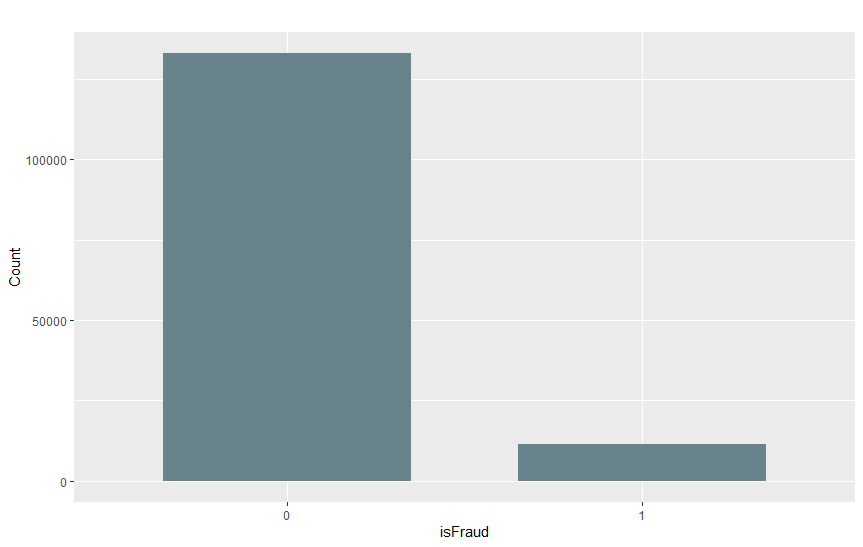{#fig-figure3}
:::  

<p>&nbsp;</p>

The transaction amount distribution is roughly centered, with most transactions clustered around mid-range values and fewer occurring at the extremes. This suggests the dataset is not heavily skewed toward very small or very large amounts.

:::{.text-center}
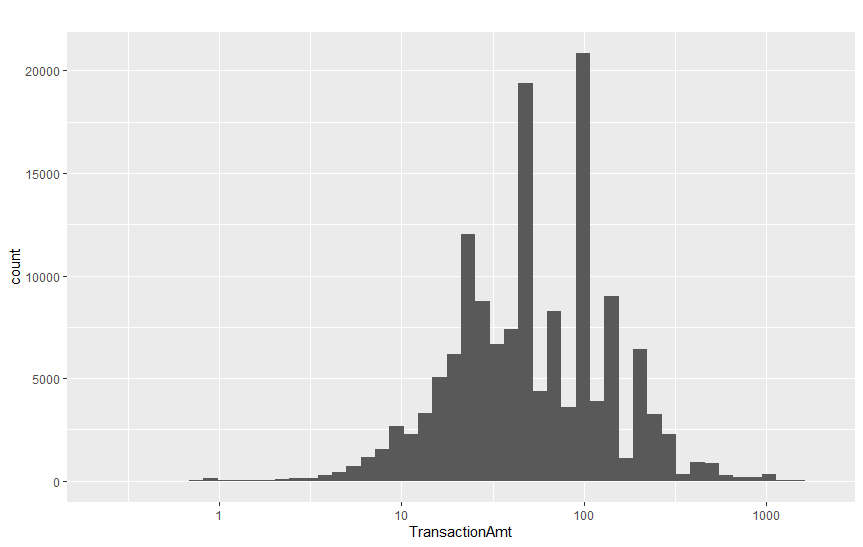{#fig-figure4}
:::  

<p>&nbsp;</p>

Transaction amounts are very similar across fraud and non-fraud: both have a median of \$50 and an interquartile range of \$25–\$100. About 98.8% of all transactions are under \$500. The fraud class has a slightly higher mean (\$88.8 vs $83.1), however, there is no major difference in the distribution.

:::{.text-center}
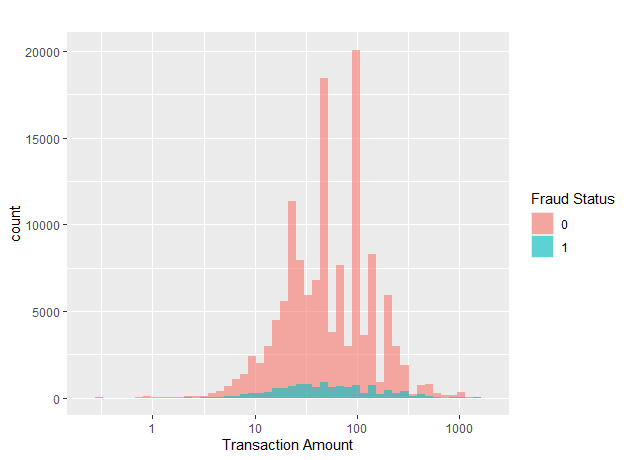{#fig-figure5}
:::  

<p>&nbsp;</p>


Fraud rates differ by card type: credit cards show the highest fraud rate at 8.9% (6,693 of 75,090 transactions), followed by debit cards at 6.7% (4,613 of 68,950). Transactions labeled as “unknown” have a similar 6.7% rate, while charge cards show no fraud cases. This indicates that credit cards are more frequently used in fraudulent activity than debit or charge cards.

:::{.text-center}
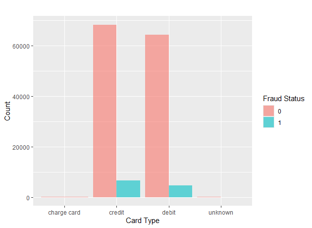{#fig-figure6}

:::  


| Card Type       | Total Transactions | Fraud Cases | Fraud Rate |
|------------------|--------------------|--------------|-------------|
| Credit           | 75,090             | 6,693        | 8.9%        |
| Debit            | 68,950             | 4,613        | 6.7%        |
| Unknown          | 178                | 12           | 6.7%        |
| Charge Card      | 15                 | 0            | 0.0%        |
       
        Table 2. Details of fraud rate by card type

<p>&nbsp;</p>

Fraud by Payment Network. Fraud appears unevenly distributed across networks. MasterCard shows the highest fraud rate at 8.9% (3,920 out of 44,186 transactions), followed by Discover at 7.8%. The Visa network, however, accounts for the largest total number of transactions, and therefore the highest absolute count of fraud cases.

:::{.text-center}
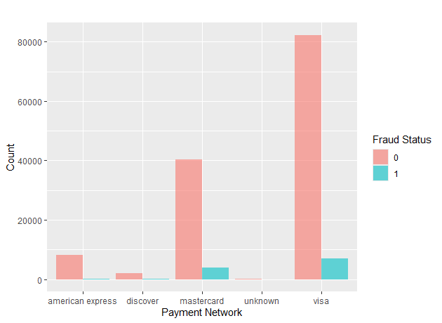{#fig-figure7}

:::  


<p>&nbsp;</p>

Distribution of transactions by originating device type.

:::{.text-center}
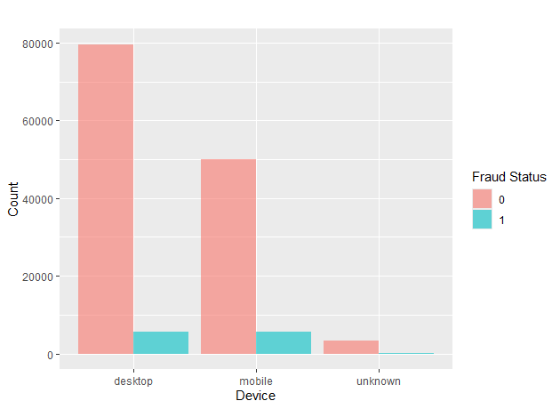{#fig-figure8}

:::  

<p>&nbsp;</p>

A few product types account for most fraud cases, pointing toward specific product segments with higher vulnerability.

:::{.text-center}
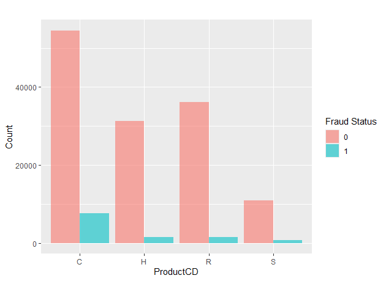{#fig-figure9}

:::


<p>&nbsp;</p>

***Correlation Analysis.*** To explore the relationships among numeric variables, a correlation matrix was computed. This visualization helps identify pairs of features that move together, revealing potential multicollinearity or redundant predictors. Strong positive or negative correlations highlight variables that may carry overlapping information, which can inform feature selection and model simplification.

:::{.text-center}
{#fig-figure10}

:::  

<p>&nbsp;</p>

***Data Preparation***  

Before creating a fraud detection Random Forest model, we first need to conduct a few final adjustments so the data works well with the model; this includes converting the transaction timestamp (*TransactionDT*), originally stored as an offset in seconds, into a proper date. We also converted key categorical fields such as card type, device type, and the target variable isFraud into factors. Some variables with extremely high cardinality are intentionally excluded from factor conversion to avoid overwhelming the Random Forest model while others have their factor names sanitized with prefixes to prevent issues during model training.


***Model Fitting***  

The dataset is split into an 80/20 train-test partition to allow for unbiased evaluation. Because fraud datasets are highly imbalanced, two additional training sets are created using SMOTE oversampling: one where the minority fraud class is increased to half the size of the majority class, and another where the minority and majority classes are fully balanced. This was done to compare the impact of the bias in the dataset and the impact that certain features would have to the final model’s performance [@Ghaleb2023]. These transformations are implemented using the *recipes* and *themis* packages, which allow certain high-cardinality fields to be marked as identifiers so they are excluded from SMOTE processing.    

```{r}
#| eval: false
#| echo: true

plot_value_ratio <- function(df1, df2, df3, feature, value_A, value_B,
                             df_names = c("Base", "Upsampled 50%", "Upsampled 100%"))
  
  # Function to compute ratio of two values
  compute_ratio <- function(df, feature, value_A, value_B) {
    df %>%
      summarize(
        count_A = sum(.data[[feature]] == value_A, na.rm = TRUE),
        count_B = sum(.data[[feature]] == value_B, na.rm = TRUE)
      ) %>%
      mutate(ratio = count_A / count_B) %>%
      pull(ratio)
  }
  
  # Create dataframe of ratios
  ratios <- data.frame(
    dataset = df_names,
    ratio = c(
      compute_ratio(df1, feature, value_A, value_B),
      compute_ratio(df2, feature, value_A, value_B),
      compute_ratio(df3, feature, value_A, value_B)
    )
  )
  
  ratios$dataset <- factor(ratios$dataset, levels = c("Base", "Upsampled 50%", "Upsampled 100%"))
 
 # trick
```  

The resulting datasets (original, 50% oversampled, and 100% oversampled) serve as the basis for three different Random Forest models (@fig-figure11).  

<p>&nbsp;</p>

:::{.text-center}
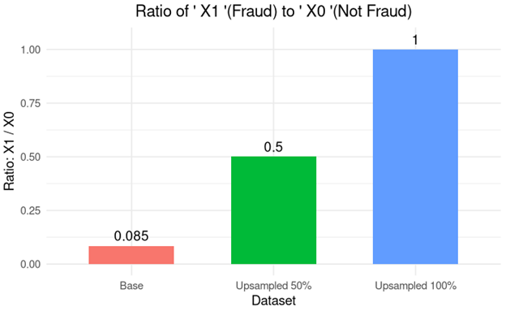{#fig-figure11}

:::  

<p>&nbsp;</p>

During training of the final models, we define a custom grid search function that evaluates different combinations of hyperparameters such as the number of trees, variables tried at each split, and whether to compute variable importance. For each configuration, the function trains a Random Forest, measures accuracy and false positive rate on an internal validation split, and identifies the best set of parameters based on those metrics.  


```{r}
#| eval: false
#| echo: true

# Define hyperparameter grid
param_grid <- expand.grid(
  ntree = ntree_values,
  mtry = mtry_values,
  importance = importance_values
)
results <- data.frame()
# Grid search: train and evaluate a model for each combination
for (i in 1:nrow(param_grid)) {
  params <- param_grid[i, ]
  model <- randomForest(
    as.formula(paste(target, "~ .")),
    data = train,
    ntree = params$ntree,
    mtry = params$mtry,
    importance = params$importance
  )
  preds <- predict(model, newdata = test)
  cm <- confusionMatrix(preds, test[[target]])

  acc <- cm$overall["Accuracy"]
  tn <- cm$table[1,1]
  fp <- cm$table[1,2]
  fpr <- fp / (fp + tn)

  results <- rbind(results, data.frame(
    ntree = params$ntree,
    mtry = params$mtry,
    importance = params$importance,
    Accuracy = acc,
    False_Positive_Rate = fpr
  ))
}

```  
Using the optimized settings (*mtree=50*, *ntry=5*), three Random Forest models are trained: one on the original data, one on the 50% oversampled data, and one on the fully balanced data. These tests allowed us to identify that the best performing models were the ones with fewer trees and fewer features considered at each split, rather than those with larger values for these parameters. 

The ROC curve  gives us a clear picture of how well our models separate fraudulent transactions from legitimate ones (@fig-figure12). As shown in the graph, the three versions of the data performed relatively well. Their curves all rise quickly toward the top-left corner, which means they achieve high true positive rates even when the false positive rate is low.  

<p>&nbsp;</p>

:::{.text-center}
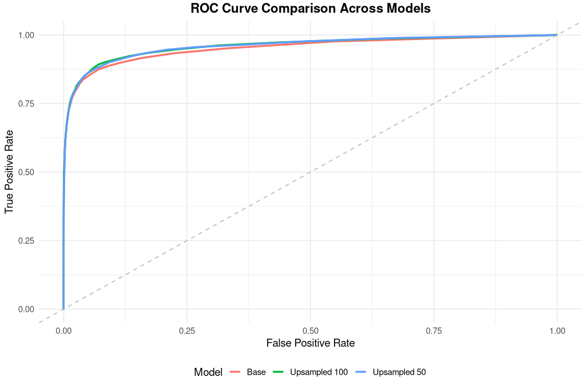{#fig-figure12}

:::  

<p>&nbsp;</p>

Even though the curves all look similar, the oversampled models perform better. Balancing the data through SMOTE gives the model more examples of fraud to learn from, which leads to small but noticeable improvements in detecting fraud early on the curve. Overall, the shape of all three ROC curves suggests very high AUC values, which indicates excellent ability to rank transactions by fraud risk. This trend is consistent with findings in previous research showing that adding synthetic minority samples can help models perform better on imbalanced data.  

Table 3 presents the top features ranked by their importance in the Random Forest model, ordered by the MeanDecreaseGini criterion. These variables contributed the most to the model’s ability to distinguish between fraudulent and legitimate transactions, providing insight into which aspects of the data the model relied on most during prediction.

<p>&nbsp;</p>


| Feature        |      X0    |      X1    | MeanDecreaseAccuracy | MeanDecreaseGini |
|----------------|------------|------------|------------------------|------------------|
| C1             |  8.729512  | 21.144007  | 19.033931              | 8523.120         |
| PC3            |  6.789584  | 16.075576  | 15.556632              | 6033.349         |
| C13            | 16.672112  | 17.732353  | 18.100839              | 5762.509         |
| C14            | 15.510688  | 13.755838  | 14.252198              | 5380.905         |
| PC2            |  8.425228  | 11.692212  | 11.797115              | 4813.375         |
| TransactionID  | 15.785669  | 30.761484  | 31.489951              | 4299.609         |
| TransactionDT  | 11.229870  | 18.347528  | 19.021460              | 4103.147         |
| PC4            | 10.610300  | 15.020564  | 15.174763              | 3574.724         |
| PC9            |  8.016019  | 16.159586  | 16.370353              | 3311.446         |
| TransactionAmt | 19.619012  | 42.477480  | 41.953280              | 3171.593         |
| C2             |  5.512165  | 12.679897  | 13.498572              | 2883.304         |
| id_02          | 23.489764  | 37.741852  | 38.379382              | 2748.055         |
| C11            |  8.000552  | 12.349480  | 12.362402              | 2692.221         |
| card1          | 11.069711  | 30.014099  | 29.387611              | 2678.225         |
| PC1            |  7.466844  | 12.282018  | 12.781813              | 2427.450         |

    Table 3. Feature importance table ordered by MeanDecreaseGini

<p>&nbsp;</p>

The Random Forest built-in functionality to assess feature importance can use variable permutation or averaging the Gini index. Both methods can produce different results. ***Figure 13*** shows the first 15 ranked features and their corresponding effect on the model output based on the two measures MeanDecreaseGini(MDG) and MeanDecreaseAccuracy(MDA). Features with higher MDG were used more often, and more effectively, to split the data into purer groups. Higher MDA indicates that accuracy drops sharply when the feature is randomized.

<p>&nbsp;</p>


 <!--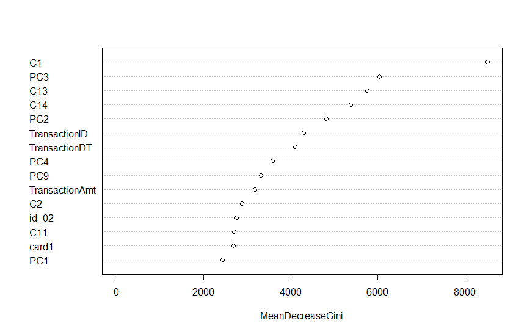{} {}-->
 
:::{.text-center} 
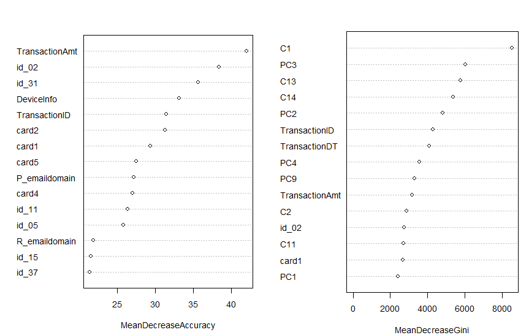{#fig-figure13}
:::

<p>&nbsp;</p>

We also examined the confusion matrix to understand how the model performed on the test data (@fig-figure14). The model correctly identified 26,393 legitimate transactions and 1,549 fraudulent ones, which shows that it learns the general pattern of the data well. However, it also produced 189 false positives and 716 false negatives.  

This imbalance between true positives and false negatives shows how challenging it can be to work with a dataset where fraud cases are extremely rare. While the Random Forest performs well overall, the confusion matrix makes it clear that there’s still room for improvement. Adjusting the classification threshold, experimenting with additional resampling techniques, or using cost-sensitive methods could help the model detect more fraudulent transactions and reduce the number of missed cases.  

<p>&nbsp;</p>


| Metric       | Value      |
|--------------|------------|
| Accuracy     | 0.9690     |
| Precision    | 0.9735     |
| Recall       | 0.9934     |
| Specificity  | 0.6830     |
| F1 Score     | 0.9834     |


    Table 4. Performance metrics

<p>&nbsp;</p>

:::{.text-center}
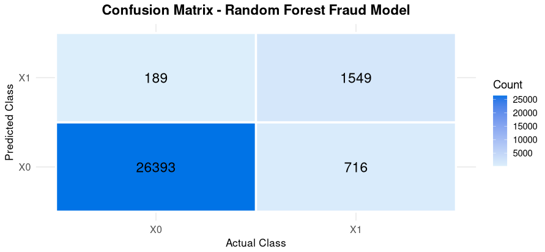{#fig-figure14}
:::  

<p>&nbsp;</p>


## Conclusions  


Random Forest is a versatile and reliable machine learning algorithm widely used for both classification and regression tasks. Its ability to handle large feature sets, capture nonlinear relationships, and reduce overfitting through ensemble averaging makes it a strong choice for many complex predictive modeling problems. Because it is robust to noise, missing data, and outliers, Random Forest often performs well even when working with imperfect or unbalanced datasets.  

In our project, we applied Random Forest to the task of credit card fraud detection and examined how data preprocessing, feature engineering, and sampling strategies affected model performance. After preparing and cleaning the dataset, we explored different oversampling approaches to address the severe class imbalance and evaluated how these changes influenced the model’s ability to detect fraud. Through this process, we found that Random Forest consistently performed well across multiple versions of the dataset, including the baseline and oversampled models.  

Our analysis showed that balancing the data helped the model better identify fraud cases, and the tuning experiments provided insight into how parameters such as the number of trees and the *mtry* value influence predictive accuracy. These steps allowed us to build a model that performs effectively while also highlighting areas where further improvements could be made. Overall, this project demonstrates the strength of Random Forest as a modeling approach and reinforces the importance of thoughtful preprocessing and evaluation when dealing with highly imbalanced real-world datasets.


## References

