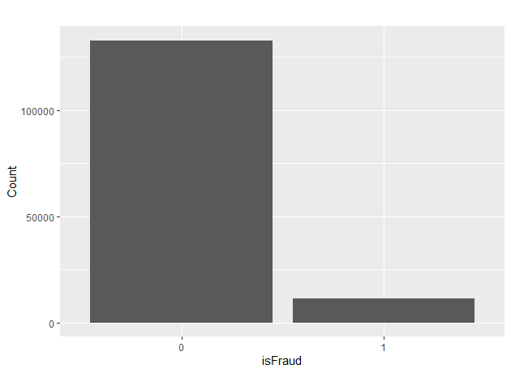
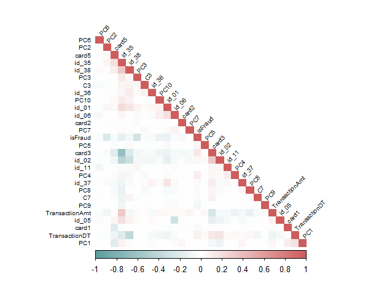

##  Introduction

<p>&nbsp;</p>

- Random Forest is a machine learning algorithm that constructs multiple decision trees


- The method aggregates the predictions of these trees to produce a final classification


- This approach reduces overfitting compared to a single decision tree


- Random Forest is known for achieving strong predictive performance


- Provides practical interpretability through tools like feature importance and OOB error


## Why Use Random Forest?

<p>&nbsp;</p>

- Decision trees can be unstable and highly sensitive to small changes in data


- Random Forest improves stability by averaging many trees


- Introduces randomness through bootstrapped samples of the data and random subsets of features at each split


- These mechanisms reduce variance and improve generalization


## How Random Forest Works

<p>&nbsp;</p>

- Each tree is trained on a bootstrap sample of the data


- At each node, a random subset of predictors is chosen for splitting


- Final prediction is based on the majority vote of all trees


- Out-of-bag samples provide a built-in estimate of error


- The method balances bias and variance through ensemble learning


## Method


<p>&nbsp;</p>

- Bootstrap sampling creates new samples by randomly drawing with replacement


- Trees are grown until all terminal nodes (leaves) are pure or another stopping criterion is met


- A result is reached by aggregating the predictions of the individual trees

  - Classification: majority vote of the trees (mode)

  - Regression: average of the tree predictions


## Splitting criteria

<p>&nbsp;</p>

At every node the best split is selected based on an impurity measure

<p>&nbsp;</p>

- Gini index(classification): &nbsp; $i_G(t) = 1 - \sum_{k=1}^{J} p(c_k \mid t)^2$

<p>&nbsp;</p>

- Entropy(classification): &nbsp; $i_H(t) = - \sum_{k=1}^{J} p(c_k \mid t) \, \log_2 \big( p(c_k \mid t) \big)$

<p>&nbsp;</p>

- Mean Squared Error(regression): &nbsp; $\text{MSE} = \frac{1}{N} \sum_{i=1}^{N} (y_i - \hat{y}_i)^2$


## Hyperparameters

<p>&nbsp;</p>

Hyperparameter tuning balances model complexity, computation, and generalization

Commonly tuned parameters are:

<p>&nbsp;</p>

 - *ntree*: number of trees

 - *maxnodes*: maximum depth of each tree

 - *mtry*: number of features considered at each split

 - *nodesize*: controls the minimum number of observations a terminal node (leaf) must have

<p>&nbsp;</p>

Grid and randomized search are commonly used for hyperparameters tuning, improving model accuracy and robustness in a systematic way [@Probst2019]


## Class imbalance

<p>&nbsp;</p>

Random Forests can perform poorly under severe class imbalance because trees tend to favor the majority class

Commonly used, Synthetic Minority Over-Sampling Technique (SMOTE) generates synthetic minority-class samples to balance the dataset [@Zhang2024]

<p>&nbsp;</p>

:::{.fig-center}
{#fig-figure1}
:::

## Data Description

- The dataset represents over 140k card transactions with over 300 features per transaction and are identified as either fraud or not fraud

::: {.panel-tabset}

## Target Variable

- The target class is largely imbalanced with 92.15% non-fraud vs 7.95% fraud 
{}

## Transaction Amounts

- The fraud class has a slightly higher average transaction amount (\$88.8 vs \$83.1)


## Card Issuer
- MasterCard shows the highest fraud rate at 8.9% , followed by Discover at 7.8%
 

:::

## Data Preparation

- Empty and incomplete features were dropped entirely

- To consolidate the number of features, PCA was applied

- Remaining dataset composition: 

<br>

| Card Type | Total Transactions | Fraud Cases | Fraud Rate |
|----|----|----|----|
| Credit | 75,090 | 6,693| 8.9%|
| Debit| 68,950 | 4,613| 6.7%|
| Unknown| 178| 12 | 6.7%|
| Charge Card| 15 | 0| 0.0%|


## Data Feature Relationships

- Minimal correlation impact from remaining features

:::{.fig-center}

{#fig-figure2}
:::

## Balancing the Target Class

- Upsampled using SMOTE to 50% and 100%
<br>

:::{.fig-center}
{#fig-figure4}
:::

## Optimizing the model

Hyper-parameters used for tuning the model:

- Number of Trees
- Number of Features in each Tree
- Feature Importance

```{r}
#| eval: false
#| echo: true

# Define hyperparameter grid
param_grid <- expand.grid(
  ntree = ntree_values,
  mtry = mtry_values,
  importance = importance_values
)
results <- data.frame()
# Grid search: train and evaluate a model for each combination
for (i in 1:nrow(param_grid)) {
  params <- param_grid[i, ]
  model <- randomForest(
    as.formula(paste(target, "~ .")),
    data = train,
    ntree = params$ntree,
    mtry = params$mtry,
    importance = params$importance
  )
  preds <- predict(model, newdata = test)
  cm <- confusionMatrix(preds, test[[target]])
}
```

Voting Method:
Aggregation of majority of trees 


## Creating the Model

- Data was split 80/20 for train and test
- Grid search was conducted over all three datasets and the three hyper-parameters
- Determining metrics of model performance were accuracy and the false positive rate
<br>

```{r}
#| eval: false
#| echo: true

 # Train model
    model <- randomForest(
      formula = as.formula(paste(target, "~ .")),
      data = train,
      ntree = params$ntree,
      mtry = params$mtry,
      importance = params$importance
    )
    
    # Predict on test set
    preds <- predict(model, newdata = test)
```


## Model Evaluation 

- The model was evaluated with the ROC curve and the confusion matrix, achieving an AUC of 0.96 and an accuracy of 0.97

::: {.panel-tabset}

## ROC Curve

The ROC curve shows that the three versions of the data performed relatively well, achieving high true positive rates.

::: {.fig-center}
{width=60% height=4.3in}
:::

## Confusion Matrix

The model correctly identified 26,393 legitimate transactions and 1,549 fraudulent ones, producing 189 false positives and 716 false negatives.

::: {.fig-center}
<br>
{width=60% height=4in}
:::


## Performance Metrics

<p>&nbsp;</p>
<p>&nbsp;</p>

<table style="width:100%">
<tr><th>Metric</th><th>Value</th></tr>
<tr><td>Accuracy</td><td>0.9690</td></tr>
<tr><td>Precision</td><td>0.9735</td></tr>
<tr><td>Recall</td><td>0.9934</td></tr>
<tr><td>Specificity</td><td>0.6830</td></tr>
<tr><td>F1 Score</td><td>0.9834</td></tr>
<tr><td>AUC</td><td>0.9597</td></tr>
</table>


:::


## Feature Importance

Feature importance analysis revealed the top features ranked by their importance in the Random Forest model.

<br>

:::{.fig-center} 
{}
:::


## Findings From This Project
<br>

- Applying Random Forest to the dataset showed how preprocessing affects results
- Balancing the highly imbalanced classes improved the model’s ability to detect target cases
- Hyperparameter tuning influenced predictive performance
- Model evaluation metrics helped assess accuracy and overall behavior


## Strengths Demonstrated by this Model
<br>

- Capable of achieving strong predictive performance with relatively few tuning requirements
- Robust against noise and fluctuations in the data
- Produces interpretable measures such as feature importance
- Offers out-of-bag error estimates for internal validation


## Conclusion
<br>

- Random Forest is a versatile and reliable machine learning algorithm
- Random Forest is well suited for both classification and regression tasks
- Handles datasets with complex relationships and many features
- Maintains strong performance even in the presence of noise, missing data, and outliers
- The ensemble approach helps to reduce overfitting and increase accuracy


## References